# Project Description — Guardian Frog 🐸

---

## 1. Project Overview

- **Project Name:** Guardian Frog: Infinite Survival

- **Brief Description:**
  Guardian Frog is a 2D side-scrolling action-survival game developed in Python using Pygame-CE. The player controls a frog character who must survive endless waves of insect enemies across a wide horizontally-scrolling platforming world. The core gameplay loop revolves around the frog's ability to **snatch enemies with its tongue**, **swallow them to absorb their elemental powers**, and then **unleash those powers** as special attacks. Every 25 enemy defeats, a powerful **Queen Bee boss** appears as a major encounter.

  The project is split into two components: a **Game Component** — a fully playable Pygame-based game with pixel-art sprites, physics, multiple enemy types, a boss fight, and visual VFX effects; and a **Data Component** — a live statistics dashboard built with Tkinter and Matplotlib that records and visualises six per-event gameplay features including attack patterns, hover behaviour, damage taken, and ability usage.

- **Problem Statement:**
  Most casual platformers aggregate data only at the end of each session (one row per game), making it nearly impossible to collect 100+ meaningful records without playing 100 separate times. Guardian Frog solves this by shifting to **per-event logging** — every individual attack, kill, hover, and damage hit is recorded as its own row, allowing a single 5-minute session to generate hundreds of statistically useful records.

- **Target Users:**
  - Course graders evaluating the OOP, game-component, and data-component criteria
  - Casual players who enjoy short, replayable arcade-style survival challenges
  - Students studying event-driven data collection patterns in game development

- **Key Features:**
  - 🐸 **Tongue-Snatch & Power Copy** — capture enemies with the tongue, then spit or swallow them to steal their elemental ability
  - 🔁 **Power-Swap Gate** — must discard the current ability (Q) before swallowing a new one, adding strategic decision-making
  - 🔥❄️⚔️ **Three Abilities** — Flamethrower (hold K), Snowfall / Snow Wall (press K), Sword Whirlwind (press K), each with pixel-art VFX
  - 👑 **Queen Bee Boss** — spawns every 25 kills with 20 HP segments, fires aimed stingers, floats freely
  - 💖 **Granular 4-State HP Bar** — supports quarter-unit damage (0.25 / 0.5 / 0.75 / 1.0) with distinct visual fill states per segment
  - 🎨 **Unified 8-bit Pixel Art** — all sprites, HUD, VFX, and fonts drawn on a fixed pixel grid
  - 📊 **Real-Time CSV Event Logger** — six event types written per-event for downstream statistical analysis and visualisation

- **Proposal:** [original proposal.pdf](original%20proposal.pdf)
- **UML Class Diagram:** [uml.pdf](uml.pdf)

- **YouTube Presentation (~7 minutes):** *([ YouTube link here ](https://youtu.be/ROTMmpUOyjk))*
  1. Short intro and demonstration of the game and statistics dashboard
  2. Explanation of class design and OOP usage
  3. Explanation of statistical data and visualisation results

---

### Gameplay Screenshots

| Main Menu | In-Game Survival |
|:---:|:---:|
| 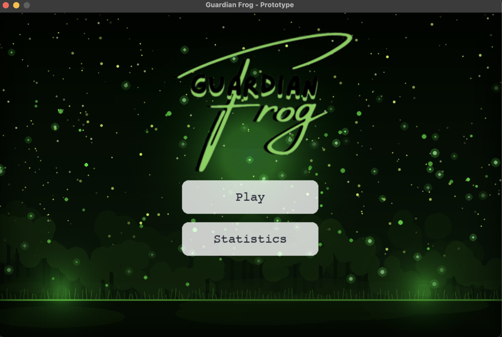 | 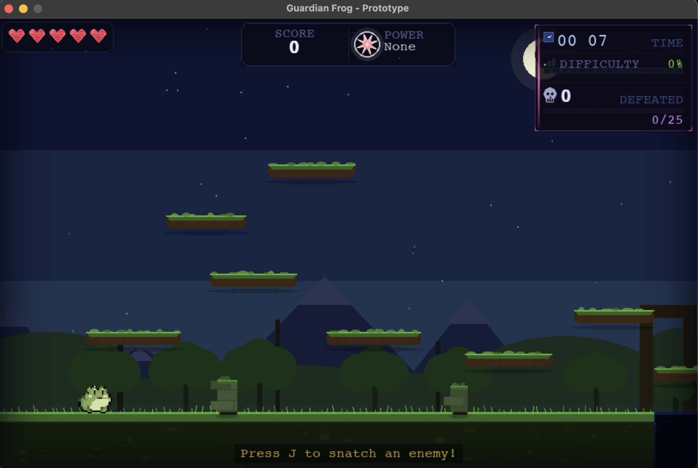 |

| Queen Bee Boss Fight | Game Over |
|:---:|:---:|
| 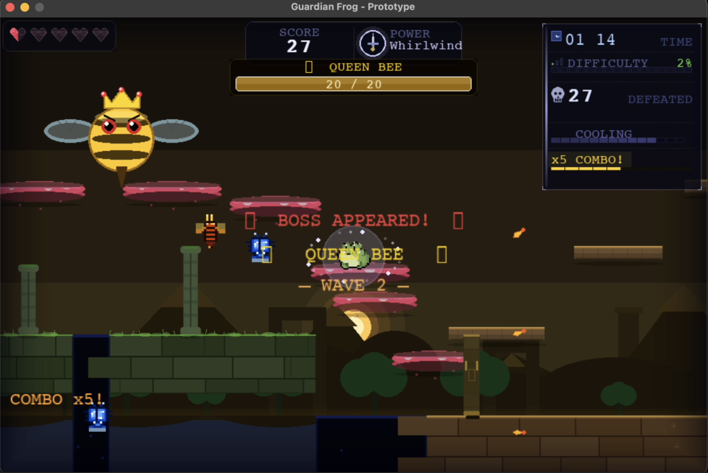 | 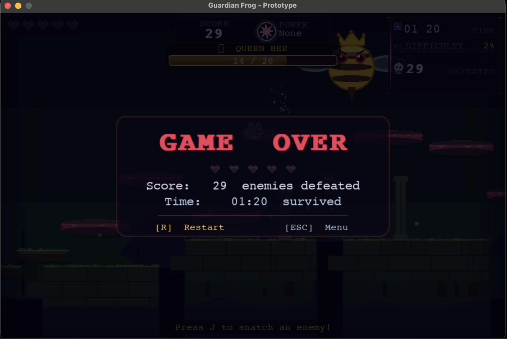 |

| ice wall Ability | Sword Whirlwind Ability |
|:---:|:---:|
| 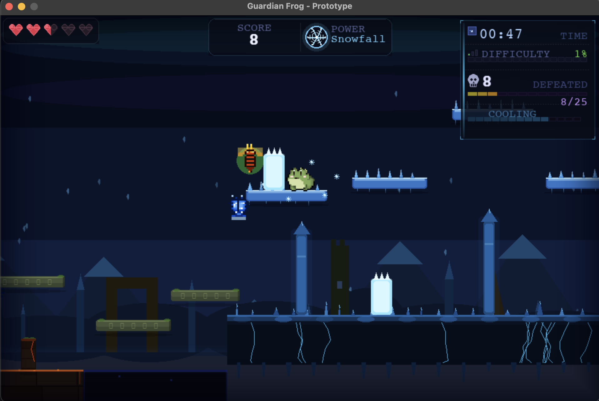 | 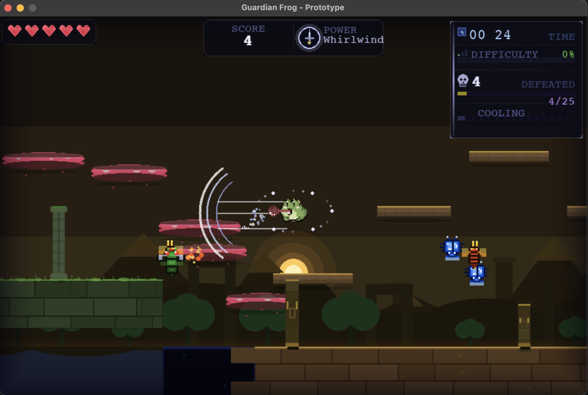 |

---

### Statistics Dashboard Screenshots

| Summary Tab | Graphs Tab |
|:---:|:---:|
| 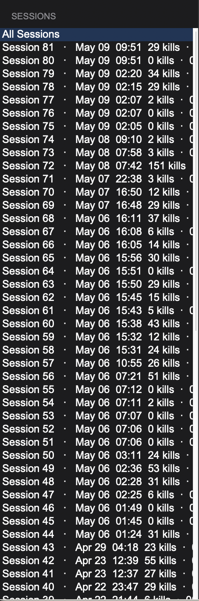 | 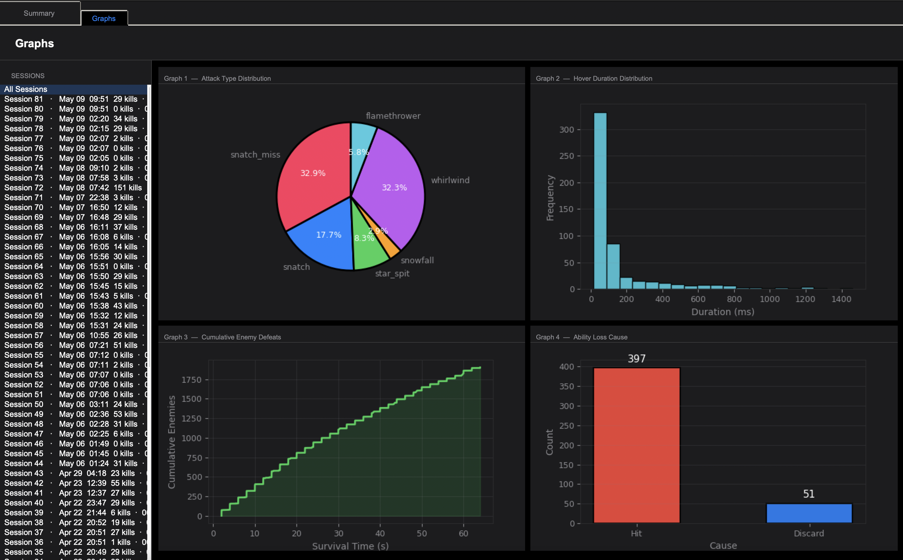 |

| Graph 1 — Attack Type (Pie) | Graph 2 — Hover Duration (Histogram) |
|:---:|:---:|
| 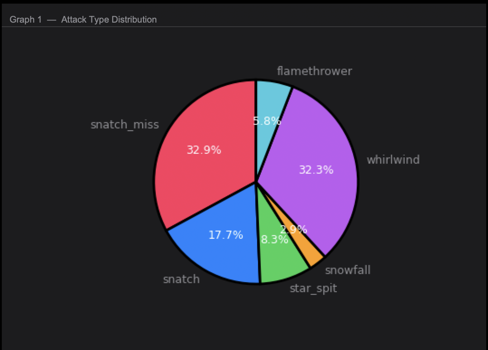 | 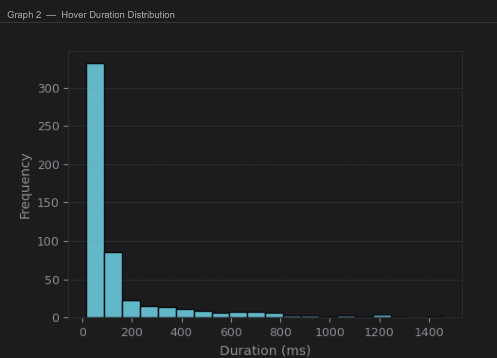 |

| Graph 3 — Kills per Session | Graph 4 — Ability Loss Cause |
|:---:|:---:|
| 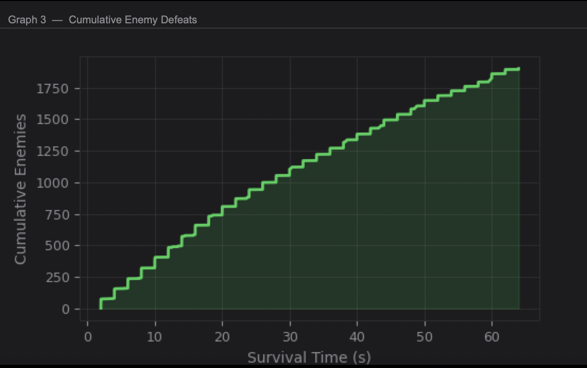 | 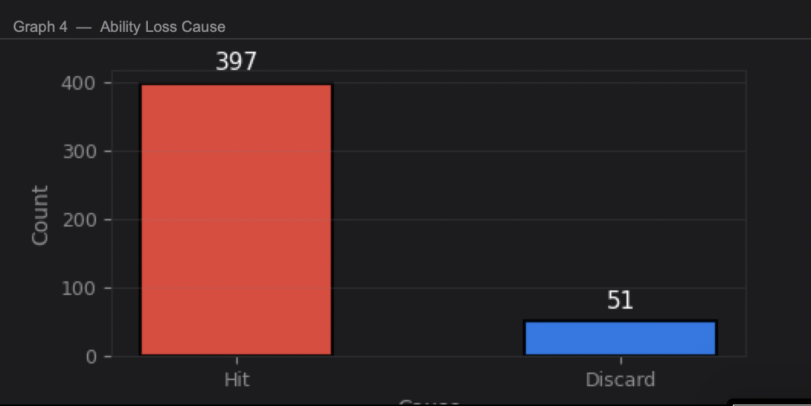 |

> Full screenshots: [`screenshots/gameplay/`](screenshots/gameplay/) and [`screenshots/visualization/`](screenshots/visualization/)

---

## 2. Concept

### 2.1 Background

This project exists to answer a design question: can a 2D survival game feel strategically deep when the player's entire toolkit is determined by which enemies they choose to fight and capture? Rather than giving the player a fixed weapon, Guardian Frog forces a constant decision — snatch the enemy for an instant projectile, or swallow it and copy its power for a more powerful ability at the cost of vulnerability.

The data component was motivated by a real constraint in game analytics: per-session logging makes it impractical to collect enough records in a reasonable number of play sessions. By redesigning the logging architecture around individual events, a single session generates far more statistically useful data, allowing meaningful analysis of combat preference, playstyle, and difficulty experience from just a few runs.

### 2.2 Objectives

- Build a fully playable infinite-survival platformer using Python and Pygame-CE with no external game engine
- Implement an ability-absorption combat loop that gives the player meaningful strategic decisions every wave
- Design three distinct enemy archetypes and a recurring boss fight that escalate difficulty over time
- Log six event types during gameplay using a `DataLogger` class and visualise them in a Tkinter + Matplotlib dashboard
- Demonstrate core OOP principles — inheritance, composition, and dependency — through a 10-class architecture
- Render all visuals, HUD elements, and fonts using a unified 8-bit pixel-art system with a custom `PixelFont` class

---

## 3. UML Class Diagram

The full class diagram is attached as **[UML.pdf](./UML.pdf)**.

It contains **10 classes** with attributes, methods, and four relationship types:

- **Inheritance** (`▲`) — `Player` and `InsectEnemy` extend `Entity`
- **Composition** (`◆`) — `GameManager` owns `Player`, `DataLogger`, `PixelFont` (×3), `QueenBeeBoss`
- **Aggregation** (`◇`) — `GameManager` manages `InsectEnemy[*]`, `Projectile[*]`, `SnowWall[*]`, `BossStinger[*]`
- **Dependency** (`┄→`) — `Player` creates `Projectile`/`SnowWall`; `QueenBeeBoss` creates `BossStinger`; `Player` logs to `DataLogger`

**Mermaid preview** *(renders inline on GitHub):*

---

## 4. Object-Oriented Programming Implementation

- **`Entity`** *(entities.py)* — Abstract base class for all physics objects. Provides `rect`, `velocity_x/y`, `is_grounded`, `apply_gravity()`, and `move(solid_rects)` for AABB collision resolution.

- **`Player`** *(entities.py)* — Extends `Entity`. Manages frog health, jump state, held/swallowed ability, and all input-driven actions: `snatch_tongue()`, `swallow()`, `discard_ability()`, `jump()`, `on_hit()`.

- **`InsectEnemy`** *(enemies.py)* — Extends `Entity`. Represents one of three insect types (fire wasp, ice beetle, sword mantis) with ground and flying AI, animated sprites, and a 25% chance to spawn as a flying variant.

- **`QueenBeeBoss`** *(enemies.py)* — Standalone boss class. Floats sinusoidally above the player, fires aimed stingers on cooldown, and has 20 HP. Spawns every 25 enemy kills.

- **`Projectile`** *(projectiles.py)* — Handles star spit, flamethrower particles, and sword swing projectiles. Each has its own `speed`, `damage`, `lifetime_ms`, and 8-bit pixel-art `draw()`.

- **`SnowWall`** *(projectiles.py)* — Falling ice wall summoned by the Snowfall ability. Drops under gravity, collides with platforms, and damages enemies on contact.

- **`BossStinger`** *(projectiles.py)* — Aimed projectile fired by Queen Bee in spread patterns. Travels in a fixed direction and deals damage on player contact.

- **`DataLogger`** *(data_logger.py)* — Records six event types to in-memory buffers and flushes to CSV. Assigns a unique `session_id` per run and auto-migrates legacy log formats.

- **`PixelFont`** *(pixel_font.py)* — Custom 5×7 bitmap font renderer. Contains a hand-authored glyph dictionary (A–Z, 0–9, symbols) with configurable pixel scale. No external font files required.

- **`GameManager`** *(game_manager.py)* — Central controller. Owns all game objects, drives the main loop, handles level layout, collision resolution, HUD rendering, and the statistics subprocess.

- **`StatsAnalyzer`** *(stats_analyzer.py)* — Loads CSVs, partitions by session, and builds a Tkinter + Matplotlib dashboard with a session selector, statistics table, and four graph types.

**Design Patterns Used:**
- **Inheritance / Polymorphism** — `Player` and `InsectEnemy` inherit physics from `Entity` and override role-specific behaviour
- **Composition** — `GameManager` owns and orchestrates all game objects each frame
- **Factory Function** — `spawn_enemy_for_time()` adjusts enemy-type weights based on survival time
- **Class-level Caching** — `Player` and `InsectEnemy` share sprite/icon assets via class-level dictionaries
- **Observer-like Logging** — `DataLogger` receives discrete events from `GameManager` and buffers them independently of game logic

---

## 5. Statistical Data

### 5.1 Data Recording Method

Data is collected via `DataLogger.record_event(event_type, value, timestamp_ms)` called from `GameManager` at the exact moment each event occurs. Each record contains four fields:

| Field | Description |
|---|---|
| `session_id` | Unix timestamp of the run start — groups all events from one session |
| `timestamp_ms` | Milliseconds elapsed since Pygame init |
| `event_type` | Constant string identifier (e.g. `attack_type`, `enemy_defeat`) |
| `value` | Event payload (string, int, or float depending on feature) |

Records are held in per-type in-memory buffers and flushed to six separate CSV files under `logs/` when the game ends. Old 3-column legacy files are automatically upgraded to the 4-column schema on first load.

### 5.2 Data Features

| Feature | Type | What it captures | Visualisation |
|---|---|---|---|
| `attack_type` | Categorical | Which ability was used each time the player attacked | Pie chart |
| `enemy_defeat` | Numeric (ms) | Timestamp of each enemy kill — used to compute cumulative defeats | Bar / line chart |
| `hover_duration` | Numeric (ms) | Duration of each hover action before landing — shows aerial playstyle | Histogram |
| `damage_taken` | Numeric (HP) | HP lost per hit event — reveals which enemies are most dangerous | Stats table |
| `survival_time` | Numeric (s) | Periodic survival time snapshots (every 2 s) — forms a session timeline | Stats table |
| `ability_loss` | Categorical | Whether ability was lost by `discard` (Q) or `hit` — measures risk behaviour | Bar chart |

---

## 6. Changed Proposed Features

The following changes were made compared with the original proposal (v3.0):

| # | Change | Reason |
|---|---|---|
| 1 | Added **Power-Swap Gate** — must press Q to discard before swallowing a new ability | Adds strategic depth; prevents accidental ability replacement; generates `ability_loss` discard data |
| 2 | Added **Queen Bee boss** every 25 kills with 20 HP (originally 10 in proposal) | Breaks survival monotony; provides a clear difficulty milestone; boss HP raised to 20 to make the fight more engaging |
| 3 | Added **Granular HP system** with 0.25 / 0.5 / 1.0 damage values and 4-state HP bar segments | Differentiates enemy lethality; makes the HP bar informative rather than a simple counter |
| 4 | Added **`SnowWall`** and **`BossStinger`** classes (not in original proposal) | Required to implement the Snowfall ability and Queen Bee attack pattern as proper OOP classes |
| 5 | Added **`PixelFont`** class (not in original proposal) | Replaces system font dependency; ensures 8-bit visual consistency across all platforms |
| 6 | Added **`ability_loss`** as a 6th data feature (proposal had 5) | Enables direct comparison of voluntary vs. accidental ability loss, which is the most distinctive data insight of the Power-Swap Gate mechanic |
| 7 | Replaced smooth VFX (ellipse/circle) with **unified 8-bit pixel-grid VFX system** | Visual consistency with pixel-art sprites; all effects snap to the same 3–5 px art-pixel grid |

---

## 7. External Sources

### Libraries & Frameworks

| Name | Version | Purpose | License |
|---|---|---|---|
| [Pygame-CE](https://pyga.me/) | 2.5.x | Game loop, rendering, input, audio | LGPL-2.1 |
| [pandas](https://pandas.pydata.org/) | 2.x | CSV loading and data manipulation in StatsAnalyzer | BSD-3 |
| [matplotlib](https://matplotlib.org/) | 3.x | Statistical graph rendering (pie, histogram, line, bar) | Matplotlib License (BSD-style) |
| [seaborn](https://seaborn.pydata.org/) | 0.x | Graph styling and aesthetics | BSD-3 |
| tkinter | stdlib | Statistics dashboard UI framework | PSF License |

### Visual Assets

All sprite art (player frog, fire wasp, ice beetle, sword mantis, Queen Bee boss, menu backgrounds, logo) and all in-game visual effects were **generated with AI assistance (Claude, Anthropic)** and are original to this project. No third-party art assets were sourced from external repositories.

### Audio

Background music (`bg_music.wav`) was **generated with AI assistance** and is original to this project. No third-party audio assets were used.

### Font

The `PixelFont` class and its complete 5×7 bitmap glyph set were **written from scratch** as original code with no external font files or libraries.
