# DESCRIPTION — Guardian Frog 🐸

---

## Overview

**Guardian Frog** is a 2D side-scrolling action-survival game developed in Python using Pygame. The player controls a frog character who must survive endless waves of insect enemies across a wide platforming world. The core gameplay loop revolves around the frog's unique ability to **snatch enemies with its tongue**, **swallow them to absorb their powers**, and then **unleash those powers** as special attacks. Every 25 enemy defeats, a powerful **Queen Bee boss** appears that the player must defeat to earn a score bonus and keep playing.

The project is split into two components:

- **Game Component (~80%):** A fully playable Pygame-based game with animated sprites, physics, multiple enemy types, a boss fight, sound effects, and visual particle effects.
- **Data Component (~20%):** A live statistics dashboard (Tkinter + Matplotlib) that records and visualizes per-session gameplay data including attack patterns, hover behaviour, damage taken, survival time, and ability usage.

---

## Concept

### Game World
The world is a wide horizontally-scrolling level (5 000 px wide) with ground segments, platforms at varying heights, and pit hazards that deal damage and respawn the player.

### Player — The Frog
The frog is a Kirby-inspired character who can:
- **Move and multi-jump** (up to 20 jumps with decaying velocity per jump)
- **Hover** by holding the jump key mid-air, greatly reducing gravity
- **Snatch** a nearby enemy with its tongue (`J` key) and hold it in its mouth
- **Swallow** the held enemy (`S/DOWN`) to absorb its ability
- **Use abilities** (`K`) — flamethrower, snowfall (summons a snow wall), or sword swing
- **Spit a star** (`J` while enemy is held) to deal direct damage without gaining the power
- **Discard** the current ability (`Q`), which launches it as a spinning projectile

### Enemies
Three insect types spawn with increasing frequency and difficulty over time:

| Enemy | Ability | Speed | Contact Damage |
|---|---|---|---|
| Fire Wasp | Flamethrower | Fast (×1.3) | 0.5 HP |
| Ice Beetle | Snowfall | Slow (×0.75) | 1.0 HP |
| Sword Mantis | Sword Swing | Very fast (×1.5) | 0.25 HP |

A random 25% of enemies spawn as **flying variants** that ignore gravity and float directly toward the player.

### Boss — Queen Bee
After every 25 enemy defeats, the **Queen Bee** spawns. She floats sinusoidally above the player, fires 3 spread stingers on a timed cooldown, and has 10 HP. Each successive boss encounter increases her movement speed and attack rate.

### Data Collection
Six event types are logged to CSV during every session:

| Event | What it records |
|---|---|
| `attack_type` | Which ability was used each time the player attacked |
| `enemy_defeat` | Timestamp of each enemy killed |
| `hover_duration` | How long (ms) the player hovered before landing |
| `damage_taken` | Amount of damage received per hit |
| `survival_time` | Periodic survival time snapshots (every 2 s) |
| `ability_loss` | Whether the ability was lost by `discard` or `hit` |

The **Statistics Dashboard** displays these as a session-filterable interface with a summary table and four graphs (pie chart, histogram, line chart, bar chart).

---

## UML Class Diagram

```mermaid
classDiagram
    direction TB

    class Entity {
        +rect : pygame.Rect
        +velocity_x : float
        +velocity_y : float
        +apply_gravity(gravity_scale)
        +move()
    }

    class Player {
        +health : float
        +current_ability : str
        +held_enemy_type : str
        +is_grounded : bool
        +is_hovering : bool
        +jump_count : int
        +facing : int
        +animation_state : str
        +update(pressed, world_width, solid_rects, is_flamethrower_active) int
        +jump(is_flamethrower_active)
        +on_hit(amount)
        +can_attack(now_ms, cooldown_ms) bool
        +record_attack(now_ms)
        +draw(surface, camera_x)
    }

    class InsectEnemy {
        +enemy_type : str
        +is_alive : bool
        +is_grounded : bool
        +is_flying : bool
        +speed_multiplier : float
        +contact_damage : float
        +ai_behavior(player_rect, solid_rects, pit_rects, world_width)
        +draw(surface, camera_x)
    }

    class QueenBeeBoss {
        +hp : int
        +max_hp : int
        +is_alive : bool
        +float_speed : float
        +attack_cooldown_ms : int
        +update(player_rect, solid_rects, now) bool
        +take_damage(damage, now)
        +draw(surface, camera_x)
    }

    class Projectile {
        +direction : int
        +ability : str
        +damage : int
        +is_discarded : bool
        +speed : float
        +lifetime_ms : int
        +update()
        +check_impact(enemy_rect) bool
        +destroy() bool
        +draw(surface, camera_x)
    }

    class SnowWall {
        +rect : pygame.Rect
        +hp : int
        +is_grounded : bool
        +state : str
        +update(solid_rects)
        +on_hit_enemy()
        +is_destroyed() bool
        +draw(surface, camera_x)
    }

    class BossStinger {
        +rect : pygame.Rect
        +vx : float
        +vy : float
        +damage : int
        +angle : float
        +update()
        +check_impact(rect) bool
        +destroy() bool
        +draw(surface, camera_x)
    }

    class GameManager {
        +screen : pygame.Surface
        +player : Player
        +enemies : list
        +projectiles : list
        +snow_walls : list
        +boss : QueenBeeBoss
        +logger : DataLogger
        +state : str
        +enemy_count : int
        +session_time : float
        +run()
        +_start_game()
        +_restart_game()
        +_spawn_enemy()
        +_spawn_boss()
        +_update_boss(now)
        +_on_boss_defeated(now)
        +_open_stats_window()
    }

    class DataLogger {
        +session_id : int
        +buffers : dict
        +log_files : dict
        +record_event(event_type, value, timestamp_ms)
        +save_to_csv()
    }

    class StatsAnalyzer {
        +logs_dir : Path
        +_all_data : dict
        +_sessions : dict
        +_selected_sid : int
        +create_dashboard(root) tk.Tk
        +_build_summary_tab(parent)
        +_build_graphs_tab(parent)
        +_draw_pie(canvas, data)
        +_draw_hist(canvas, data)
        +_draw_line(canvas, data)
        +_draw_bar(canvas, data)
    }

    Entity <|-- Player
    Entity <|-- InsectEnemy
    GameManager "1" *-- "1" Player
    GameManager "1" *-- "0..*" InsectEnemy
    GameManager "1" *-- "0..*" Projectile
    GameManager "1" *-- "0..*" SnowWall
    GameManager "1" *-- "0..1" QueenBeeBoss
    GameManager "1" *-- "0..*" BossStinger
    GameManager "1" *-- "1" DataLogger
    GameManager ..> StatsAnalyzer : launches via subprocess
```

---

## Design Patterns Used

**Inheritance / Polymorphism** — `Entity` is the abstract base class shared by `Player` and `InsectEnemy`. Both override behaviour while sharing physics logic (`apply_gravity`, `move`).

**Composition** — `GameManager` owns all game objects (player, enemy list, projectile list, boss, logger) and orchestrates their interactions each frame.

**Factory Function** — `spawn_enemy_for_time(survival_time_s, ...)` in `enemies.py` acts as a factory that adjusts enemy-type probability weights based on elapsed game time, progressively increasing difficulty.

**Class-level Caching** — `Player` and `InsectEnemy` use class-level dictionaries (`_ability_icon_cache`, `_sprite_cache`) to load assets only once and share them across all instances.

**Observer-like Logging** — `DataLogger` receives discrete events (`record_event`) fired by `GameManager` at key moments (attack, damage, enemy defeat). It buffers them and flushes to CSV on game over or at set intervals, decoupling data collection from game logic.
