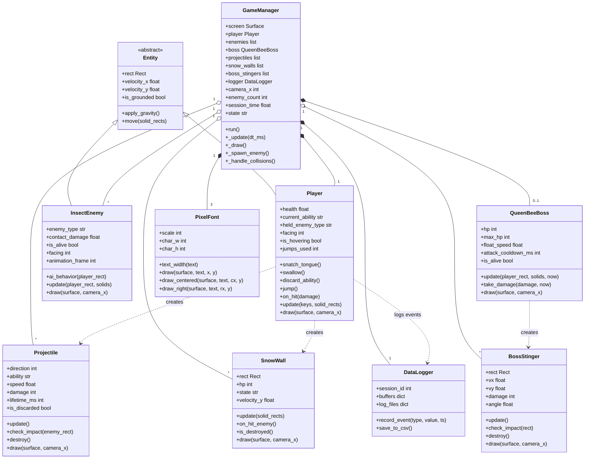

# DESCRIPTION — Guardian Frog 🐸

---

## Overview

**Guardian Frog** is a 2D side-scrolling action-survival game developed in Python using Pygame. The player controls a frog character who must survive endless waves of insect enemies across a wide platforming world. The core gameplay loop revolves around the frog's unique ability to **snatch enemies with its tongue**, **swallow them to absorb their powers**, and then **unleash those powers** as special attacks. Every 25 enemy defeats, a powerful **Queen Bee boss** appears that the player must defeat to earn a score bonus and keep playing.

The project is split into two components:

- **Game Component (~80%):** A fully playable Pygame-based game with animated sprites, physics, multiple enemy types, a boss fight, sound effects, and visual particle effects.
- **Data Component (~20%):** A live statistics dashboard (Tkinter + Matplotlib) that records and visualizes per-session gameplay data including attack patterns, hover behaviour, damage taken, survival time, and ability usage.

---

## Concept

### 2.1 Background
This project was inspired by Kirby's copy-ability mechanic — the idea of absorbing an enemy's power and turning it against others. The problem it explores is: can a simple 2D survival game feel strategically deep when the player's toolkit is entirely determined by which enemies they choose to fight and swallow? Guardian Frog is the answer: a game where every enemy is both a threat and a potential resource, and where survival depends on reading the battlefield and choosing abilities wisely.

The data component exists because player behaviour in action games is hard to reason about without evidence. By logging every attack, hover, and damage event we can answer questions like "which ability do players actually use most?" and "how does damage taken change with survival time?"

### 2.2 Objectives
- Build a fully playable infinite-survival platformer using only the Python standard library and Pygame
- Implement a Kirby-style ability absorption loop that gives the player meaningful decisions each wave
- Design three distinct enemy archetypes and a recurring boss fight that escalate difficulty over time
- Log six event types during gameplay and visualise them in a separate statistics dashboard (Tkinter + Matplotlib)
- Demonstrate core OOP principles — inheritance, composition, factory functions, and class-level caching — through the project structure

### Game World
The world is a wide horizontally-scrolling level (5 000 px wide) with ground segments, platforms at varying heights, and pit hazards that deal damage and respawn the player.

### Player — The Frog
The frog is a Kirby-inspired character who can:
- **Move** left/right with `A`/`D` or the arrow keys
- **Multi-jump** (up to 20 jumps, `W` or `UP`, with velocity decaying each jump)
- **Hover** by holding the jump key while airborne, greatly reducing gravity
- **Snatch** a nearby enemy with its tongue (`J`) and hold it in its mouth
- **Swallow** the held enemy (`S`/`DOWN`) to absorb its ability
- **Use abilities** (`K`) — the default is a **star spit** projectile; after swallowing an enemy the ability becomes flamethrower, snowfall (summons a snow wall), or sword swing
- **Spit a star** (`J` while an enemy is held) to deal direct damage without gaining its power
- **Discard** the current ability (`Q`), which launches it as a spinning projectile

### Enemies
Three insect types spawn with increasing frequency and difficulty over time:

| Enemy | Ability | Speed | Contact Damage |
|---|---|---|---|
| Fire Wasp | Flamethrower | Fast (×1.3) | 0.5 HP |
| Ice Beetle | Snowfall | Slow (×0.75) | 1.0 HP |
| Sword Mantis | Sword Swing | Very fast (×1.5) | 0.25 HP |

A random 25% of enemies spawn as **flying variants** that ignore gravity and float directly toward the player.

### Boss — Queen Bee
After every 25 enemy defeats, the **Queen Bee** spawns. She floats sinusoidally ~180 px above the player, fires 3 spread stingers on a timed cooldown, and has 20 HP. After being defeated she disappears and the kill counter resets, making her spawn again after the next 25 kills.

### Data Collection
Six event types are logged to CSV during every session:

| Event | What it records |
|---|---|
| `attack_type` | Which ability was used each time the player attacked |
| `enemy_defeat` | Timestamp of each enemy killed |
| `hover_duration` | How long (ms) the player hovered before landing |
| `damage_taken` | Amount of damage received per hit |
| `survival_time` | Periodic survival time snapshots (every 2 s) |
| `ability_loss` | Whether the ability was lost by `discard` or `hit` |

The **Statistics Dashboard** displays these as a session-filterable interface with a summary table and four graphs (pie chart, histogram, line chart, bar chart).

---

## UML Class Diagram

---

## Object-Oriented Programming Implementation

### Classes

| Class | File | Description |
|---|---|---|
| `Entity` | `entities.py` | Abstract dataclass base for all physics objects. Holds `rect`, `velocity_x`, `velocity_y` and provides `apply_gravity()` and `move()`. |
| `Player` | `entities.py` | Extends `Entity`. Manages the frog's health, jump count, held/swallowed ability, animation state, and all input-driven actions (jump, hover, snatch, swallow, attack, discard). Uses class-level caches for sprite and icon loading. |
| `InsectEnemy` | `enemies.py` | Extends `Entity`. Represents one of three insect types (fire wasp, ice beetle, sword mantis). Contains full ground and flying AI, pit avoidance, animated sprites, and a 25% chance to spawn as a flying variant. |
| `QueenBeeBoss` | `enemies.py` | Standalone boss class. Floats sinusoidally above the player, fires spread stingers on a cooldown, and has 20 HP. Spawns every 25 enemy kills. |
| `Projectile` | `projectiles.py` | Represents a player-fired attack. Handles star spit, flamethrower particle, and sword swing variants, each with different size, speed, and damage. Also handles discarded-ability spinning projectiles. |
| `SnowWall` | `projectiles.py` | A falling ice wall summoned by the snowfall ability. Drops under gravity, collides with the ground, has HP, and damages enemies on contact. |
| `BossStinger` | `projectiles.py` | Angled projectile fired by the Queen Bee in spread patterns. Flies in a fixed direction and deals damage on player contact. |
| `GameManager` | `game_manager.py` | Central game orchestrator. Owns the main loop, all game objects, the level layout, particle/VFX systems, HUD rendering, sound, and the menu/game-over states. |
| `DataLogger` | `data_logger.py` | Records six event types to in-memory buffers and flushes them to CSV on demand. Assigns each game run a unique `session_id` and handles migration of old log formats. |
| `StatsAnalyzer` | `stats_analyzer.py` | Loads all CSVs, partitions data by session, and builds a Tkinter + Matplotlib dashboard with a session list, summary statistics table, and four graph types. |
| `PixelFont` | `pixel_font.py` | Custom 5×7 bitmap font renderer with configurable pixel scale. Contains a hand-authored glyph dictionary and no external font file dependencies. Used throughout the HUD. |

### Design Patterns

**Inheritance / Polymorphism** — `Entity` is the base class shared by `Player` and `InsectEnemy`. Both inherit physics logic (`apply_gravity`, `move`) and override behaviour specific to their role.

**Composition** — `GameManager` owns all game objects (player, enemy list, projectile list, boss, logger) and orchestrates their interactions each frame.

**Factory Function** — `spawn_enemy_for_time(survival_time_s, ...)` in `enemies.py` adjusts enemy-type probability weights based on elapsed survival time, progressively increasing the ratio of slower, harder-hitting enemies.

**Class-level Caching** — `Player` and `InsectEnemy` use class-level dictionaries (`_ability_icon_cache`, `_sprite_cache`) to load image assets only once and share them across all instances.

**Observer-like Logging** — `DataLogger` receives discrete events (`record_event`) fired by `GameManager` at key moments (attack, damage, defeat). It buffers them and flushes to CSV on game over, decoupling data collection from game logic.

---

## Statistical Data

### Recording Method
Events are recorded by calling `DataLogger.record_event(event_type, value, timestamp_ms)` from within `GameManager` at the exact moment the event occurs. Each record stores a `session_id` (Unix timestamp of the run start), the event's `timestamp_ms` since Pygame init, the `event_type` string, and the `value`. Records are held in per-type in-memory buffers and flushed to six separate CSV files when the game ends.

### Data Features

| Feature | Type | What it captures |
|---|---|---|
| `attack_type` | Categorical string | The ability used each time the player fires (`star_spit`, `flamethrower`, `snowfall`, `sword_swing`) — reveals ability preference |
| `enemy_defeat` | Numeric (timestamp ms) | Millisecond timestamp of each kill — used to compute kill rate and cumulative defeats over time |
| `hover_duration` | Numeric (ms) | How many milliseconds the player hovered before touching the ground — shows aerial playstyle |
| `damage_taken` | Numeric (HP) | Amount of HP lost per damage event — reveals which hits are most costly |
| `survival_time` | Numeric (seconds) | Snapshot of total survival time logged every 2 seconds — forms a timeline of session length |
| `ability_loss` | Categorical string | Whether the current ability was lost by voluntary `discard` or by taking a `hit` — measures risk behaviour |

The **Statistics Dashboard** (`StatsAnalyzer`) displays these across two tabs: a **Summary** tab with a session selector and a statistics table (mean, median, std dev, min, max, count), and a **Graphs** tab with a pie chart (attack type distribution), histogram (hover duration), line chart (cumulative enemy defeats), and bar chart (ability loss cause).

---

## External Sources

### Libraries & Frameworks

| Name | Version | Purpose | License |
|---|---|---|---|
| [Pygame-CE](https://pyga.me/) | 2.5.x | Game loop, rendering, input, audio | LGPL-2.1 |
| [pandas](https://pandas.pydata.org/) | 2.x | CSV loading and data manipulation in StatsAnalyzer | BSD-3 |
| [matplotlib](https://matplotlib.org/) | 3.x | Statistical graph rendering (pie, histogram, line, bar, boxplot) | Matplotlib License (BSD-style) |
| [seaborn](https://seaborn.pydata.org/) | 0.x | Graph styling and aesthetics | BSD-3 |
| tkinter | stdlib | Statistics dashboard UI framework | PSF License |

### Visual Assets

All sprite art (player frog, fire wasp, ice beetle, sword mantis, Queen Bee boss, menu backgrounds, logo) and all in-game visual effects were **generated with AI assistance (Claude, Anthropic)** and are original to this project. No third-party art assets were sourced from external repositories.

### Audio

Background music (`bg_music.wav`) was **generated with AI assistance** and is original to this project. No third-party audio assets were used.

### Font

The `PixelFont` class and its complete 5×7 bitmap glyph set were **written from scratch** as original code with no external font files or libraries.