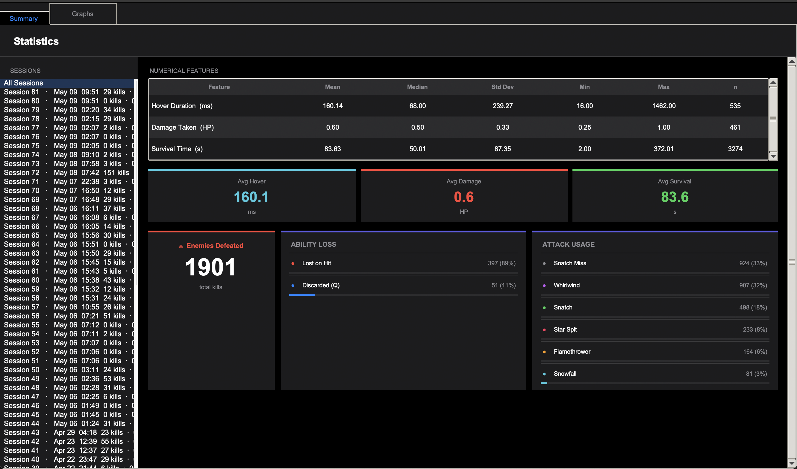
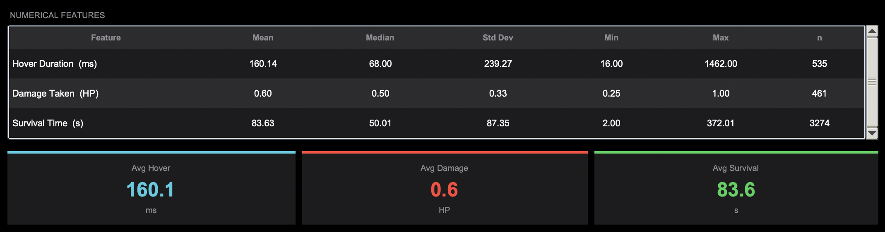
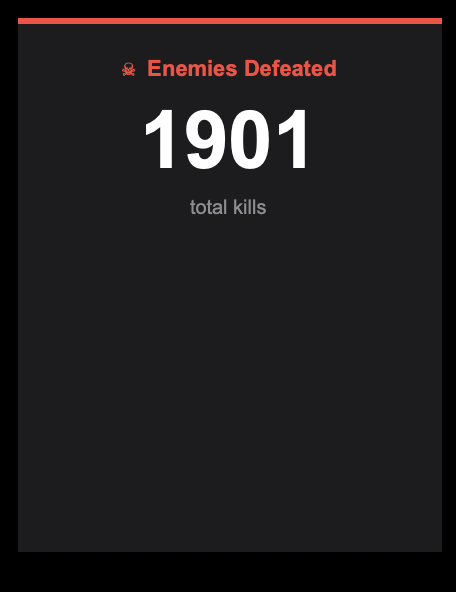
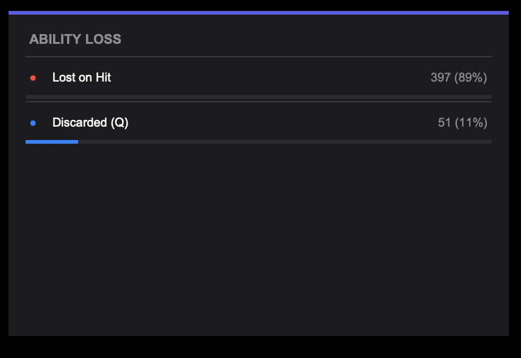
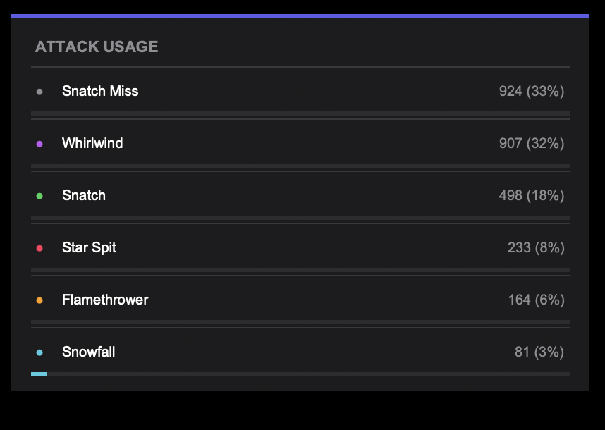

# Visualization

Statistical analysis and visualizations for **Guardian Frog: Infinite Survival**.
All figures are produced by `StatsAnalyzer` in `game/stats_analyzer.py`,
which reads event-based CSV files written by `DataLogger` to `logs/`.

---

## Overall Dashboard

The statistics dashboard is a Tkinter window with an iOS Dark Mode aesthetic. It contains two tabs — **Summary** and **Graphs** — sharing a left sidebar that lists every recorded play session, newest first. Selecting a session in either tab filters all statistics and graphs to show only that session's data. Selecting **All Sessions** at the top of the list aggregates data across every recorded run.

---

## Summary Tab

The Summary tab presents the full picture of recorded data in a single scrollable view. At the top is a descriptive statistics table, followed by average chip cards, and then three distribution info cards at the bottom. All components update instantly when a different session is selected in the sidebar.

### Component 1 — Numerical Features Table

This table provides descriptive statistics — mean, median, standard deviation, min, max, and sample count — for the three numerical features collected during gameplay. Across all sessions: Hover Duration has a mean of 160.1 ms with 535 samples, Damage Taken has a mean of 0.60 HP with 461 samples, and Survival Time has a mean of 83.6 seconds with 3,274 samples. The high sample counts confirm that per-event logging successfully generates far more than 100 records per feature in normal play.

### Component 2 — Average Chips

Three color-coded chip cards display the mean value of each numerical feature as a hero number: teal for Avg Hover (160.1 ms), red for Avg Damage (0.60 HP), and green for Avg Survival (83.6 s). These give a quick one-glance summary without requiring the player to read the full statistics table.

### Component 3 — Enemies Defeated Card

This card displays the total number of enemies defeated across the selected view. In the All Sessions view, the total is **1,901 kills**, demonstrating the scale of data collected over all play sessions. The red accent color signals combat-result data, consistent with the Damage chip and the Hit bar in the ability loss graph.

### Component 4 — Ability Loss Card

This distribution card breaks down ability-loss events by cause: **Lost on Hit** (397 events, 89%) versus **Discarded (Q)** (51 events, 11%). The large majority of losses being hit-triggered confirms that the Power-Swap Gate mechanic — which requires a deliberate Q press before swallowing a new ability — successfully reduced accidental swaps while still generating meaningful voluntary-discard data.

### Component 5 — Attack Usage Card

This card lists raw counts and percentages for every recorded attack type: Snatch Miss (924, 33%), Whirlwind (907, 32%), Snatch (498, 18%), Star Spit (233, 8%), Flamethrower (164, 6%), and Snowfall (81, 3%). The high snatch-miss rate reflects how frequently players attempt to capture enemies just out of range — a natural consequence of the tongue-based capture mechanic.

---

## Graphs Tab

The Graphs tab contains a 2×2 grid of four plots rendered with Matplotlib's TkAgg backend embedded directly into Tkinter canvases. Each graph updates when the sidebar session selection changes.

### Graph 1 — Attack Type Distribution (Pie Chart)

The pie chart shows the proportion of each attack action recorded during the selected sessions. The two dominant slices are **Snatch Miss** (32.9%) and **Whirlwind** (32.3%), followed by **Snatch** (17.7%), **Star Spit** (8.3%), **Flamethrower** (5.8%), and **Snowfall** (2.9%). The near-equal split between snatch attempts and sword ability use suggests that players who master the swallow mechanic tend to favor the Sword Mantis power for its fast cooldown, while the high snatch-miss proportion shows that enemy capture remains the most-attempted but hardest-to-execute action.

### Graph 2 — Hover Duration Distribution (Histogram)

The histogram bins every recorded hover-action duration into 20 buckets. The distribution is strongly right-skewed: the tallest bar sits below 100 ms, indicating that most hover actions are brief tap-hovers used to slow a fall or dodge an enemy. The long tail reaching beyond 1,000 ms represents deliberate sustained hovers over obstacles. This shape is consistent with intermediate-skill play — players know how to hover but rarely need to hold it for extended periods.

### Graph 3 — Total Kills per Session (Bar Chart)

The bar chart plots total enemy kills per session on the Y-axis against session number on the X-axis. Most sessions cluster near zero to fifty kills, with a few outlier sessions exceeding 100 and one session reaching approximately 325 kills. This variance in session length is expected in a survival game where difficulty scales continuously, and it confirms that the weighted random spawning and boss-cycle systems successfully create sessions of meaningfully different lengths.

### Graph 4 — Ability Loss Cause (Bar Chart)

The bar chart directly compares ability-loss counts by cause: **Hit** (397) versus **Discard** (51). The large gap between the two bars shows that losing an ability by taking damage is far more common than intentionally discarding it. This is expected because the Power-Swap Gate mechanic requires a deliberate Q press — players only discard when they specifically want to switch, making every discard a strategic decision rather than an accident.

---

## Summary of Data Volume

| Feature | Type | Records (All Sessions) | Visualization |
|---|---|---|---|
| Attack Type | Categorical | 2,807 events | Pie chart (Graph 1) + Attack Usage card |
| Enemy Defeat | Numeric | 1,901 events | Kills per session bar chart (Graph 3) + Enemies Defeated card |
| Hover Duration | Numeric | 535 events | Histogram (Graph 2) + Avg Hover chip + stats table |
| Damage Taken | Numeric | 461 events | Avg Damage chip + stats table |
| Survival Time | Numeric | 3,274 samples | Avg Survival chip + stats table |
| Ability Loss | Categorical | 448 events | Bar chart (Graph 4) + Ability Loss card |

All six features comfortably exceed the 100-record requirement. Hover Duration and Damage Taken are the lowest-volume numerical features at 535 and 461 records respectively, both well above the threshold from a moderate number of play sessions.